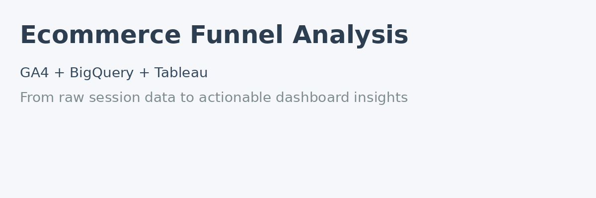

# 📈 Ecommerce Funnel Analysis  

**Tools used:** GA4 | BigQuery | SQL | Tableau  

---

## 📌 Project Goal  
Analyze user behavior and the conversion funnel in an online store using data exported from Google Analytics 4 (GA4) to BigQuery. Identify key drop-off points and provide actionable insights through interactive dashboards.

---

## 🔧 My Role  
**Full-cycle Data Analyst**  
✔️ Wrote SQL queries in BigQuery to extract session and funnel data  
✔️ Cleaned and prepared data for visualization  
✔️ Built an interactive dashboard in Tableau  

---

## 🔍 Steps performed  

1. **Data extraction in BigQuery**  
   - Collected session metadata: traffic source, device type, country  
   - Extracted funnel events: session_start, view_item, add_to_cart, begin_checkout, purchase  

2. **JOIN logic**  
   - Merged event and session data using `LEFT JOIN` on `user_session_id`  
   - Ensured that no sessions were lost due to join direction

3. **Data cleaning**  
   - Exported to `.csv` format  
   - Fixed formatting issues via Google Sheets (separated columns, preserved text formats)

4. **Visualization in Tableau**  
   - KPI Tiles: Sessions, Orders, Purchases, Conversion Rate  
   - Funnel chart  
   - Segmentations: Country, Language, Device, Campaign  
   - Purchase heatmap  
   - Date and source filters for dynamic analysis  

---

## 📊 Features  

- ✅ Visualized conversion funnel  
- 🌍 Segmentation by device, language, country, and campaign  
- 🎯 Campaign performance overview  
- 📆 Dynamic filtering for advanced analysis  

---

## 👤 Target User  

> **Mark**, a Digital Marketer  
> Needs fast and flexible insights into the sales funnel, ad performance, and user behavior to optimize marketing efforts.

---

## 🔗 Resources

- 📊 **[Live Tableau Dashboard](https://public.tableau.com/app/profile/olena.avramenko4187/viz/Project1_AvramenKo/E-commerceFunnel?publish=yes)**
- 🎥 **[Video Presentation](https://youtu.be/GLhHc8xhgt4)**
- 🧠 **[BigQuery SQL Script](https://console.cloud.google.com/bigquery?sq=446921047291:585c6e57fc614e66a9949228b4fe9b58&project=eloquent-drive-438416)**  

---

## 🙏 Special Thanks  

To my mentor **Edward**, and the amazing GoIT team – this journey was both insightful and fun 💚
